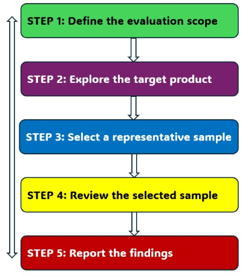

## Evaluation Procedure

This section describes the stages and activities of an evaluation procedure. The stages are not necessarily sequential. Also the exact sequence of the activities carried out during the evaluation stages depends on the type of website, the purpose of the evaluation, and the process used by the evaluator. Some of the activities can overlap or may be carried out in parallel. The following diagram illustrates the iterations between the stages defined in this section:

The workflow diagram above depicts five sequential steps: 1. Define the evaluation scope; 2. Explore the target website; 3. Select a representative sample; 4. Audit the selected sample and 5. Report the findings. Each step has an arrow to the next step, and arrows back to all prior steps. This illustrates how evaluators proceed from one step to the next, and may return to any preceding step in the process as new information is revealed to them during the evaluation process.

### Step 1: Define the Evaluation Scope  {#step1}

<strong id="req1">Methodology Requirement 1:</strong> Define the evaluation scope according to [Methodology Requirement 1.a](#req1a), [Methodology Requirement 1.b](#req1b), and [Methodology Requirement 1.c](#req1c), and optionally [Methodology Requirement 1.d](#req1d).

During this step the overall scope of the evaluation is defined. It is a fundamental step that affects the subsequent steps in the evaluation procedure. It is ideally carried out in consultation with the evaluation commissioner (who may or may _not_ be the website owner) to ensure common expectations about the scope of the evaluation. Initial exploration of the target website during this step may be necessary to better know specifics of the website and the required evaluation. Detailed exploration of the website is carried out in [Step 2: Explore the Target Website](#step2).

#### Step 1.a: Define the Scope of the Website  {#step1a}

<strong id="req1a">Methodology Requirement 1.a:</strong> Define the target [website](#website) according to [Scope of Applicability](#applicability), so that for each [web page](#webpage) it is unambiguous whether it is within the scope of evaluation or not.

During this step the target website (the web pages and states of web pages that are in scope of the evaluation) is defined. This scope of the website is defined according to the terms established in the section [Scope of Applicability](#applicability).

To avoid later mismatches of expectations between the evaluator, evaluation commissioner, and readers of the resulting evaluation report, it is important to define the target website so that it is unambiguous that a web page is within its scope. Using formalizations including [regular expressions](http://en.wikipedia.org/wiki/Regular_expression) and listings of web addresses (URIs) is recommended where possible.

It is also important to document any particular aspects of the target website to support its identification. This includes:

*   Use of third-party content and services;
*   Mobile and language versions of the website;
*   Parts of the website, especially those that may not be easily identifiable as such, for example, an online shop that has a different web address but is still considered to be part of the target website.

#### Step 1.b: Define the Conformance Target {#step1b}

<strong id="req1b">Methodology Requirement 1.b:</strong> Select a target WCAG 2.0 [conformance level](http://www.w3.org/TR/WCAG20/#cc1) ("A", "AA", or "AAA") for the evaluation.

Part of initiating the evaluation process is to define the target WCAG 2.0 conformance level ("A", "AA", or "AAA") for evaluation. WCAG 2.0 Level AA is the generally accepted and recommended target.

**Note:** It is often useful to evaluate beyond the conformance target of the website to get a more complete picture of its accessibility performance. For example, while a website might not fully meet a particular conformance level, it might meet individual requirements from a higher conformance level. Having this information can help plan future improvements more effectively.

#### Step 1.c: Define an Accessibility Support Baseline {#step1c}

<strong id="req1c">Methodology Requirement 1.c:</strong> Define the web browser, assistive technologies and other [user agents](http://www.w3.org/TR/WCAG20/#useragentdef) for which features provided on the website are to be [accessibility supported](http://www.w3.org/TR/WCAG20/#accessibility-supporteddef).

Particularly for new web technologies it is not always possible to ensure that every accessibility feature provided on a website, such as a 'show captions' function in a media player, is supported by every possible combination of operating system, web browser, assistive technology, and other user agents. WCAG 2.0 does not pre-define which combinations of features and technologies must be supported as this depends on the particular context of the website, including its language, the web technologies that are used to create the content, and the user agents currently available. [Understanding Accessibility Support](http://www.w3.org/TR/UNDERSTANDING-WCAG20/conformance#uc-accessibility-support-head) provides more guidance on the WCAG 2.0 concept of _accessibility support_.

During this step the evaluator determines the minimum set of combinations of operating systems, web browsers, assistive technologies, and other user agents that the website is expected to work with, and that is in-line with the WCAG 2.0 guidance on accessibility support (linked above). This step is carried out in consultation with the evaluation commissioner to ensure common expectation for the targeted level of accessibility support. The website owner and website developer may also have such a list of combinations that the website was designed to support, which could be a starting point for this step. Depending on the purpose of the evaluation such a list may need to be updated, for example to assess how well the website works with more current browsers.

**Note:** This initial definition of the baseline does not limit the evaluator from using additional operating systems, web browsers, assistive technologies and other user agents at a later point, for example to evaluate content that was not identified at this early stage of the evaluation process. In this case the baseline is extended with the additional tools that were used.

**Note:** For some websites in closed networks, such as an intranet website, where both the users and the computers used to access the website are known, this baseline may be limited to the operating systems, web browsers and assistive technologies used within this closed network. However, in most cases this baseline is ideally broader to cover the majority of current user agents used by people with disabilities in any applicable particular geographic region and language community.

#### Step 1.d: Define Additional Evaluation Requirements (Optional)  {#step1d}

<strong id="req1d">Methodology Requirement 1.d:</strong> Define any additional evaluation requirements agreed by the [evaluator](#evaluator) and [evaluation commissioner](#commissioner) (Optional).

An evaluation commissioner may be interested in additional information beyond what is needed to evaluate the extent of conformance of the target website to WCAG 2.0. For example, an evaluation commissioner might be interested in:

*   Evaluation of additional web pages beyond what is needed to form a representative sample from the target website;
*   Reports of all occurrences of issues rather than representative examples of the types of issues on the target website;
*   Analysis of particular use cases, situations, and user groups for interacting with the target website;
*   Description of possible solutions to the issues encountered beyond the scope of the evaluation;
*   Evaluation involving users with disabilities;
*   Adherence to specific documentation or reporting templates.

Such additional evaluation requirements that are agreed on with the evaluator need to be clarified early on and documented. This also needs to be reflected in the resulting report, for example, to clarify how the selection of the sample was carried out.

### Step 2: Explore the Target Website {#step2}

<strong id="req2">Methodology Requirement 2:</strong> Explore the website to be evaluated according to [Methodology Requirement 2.a](#req2a), [Methodology Requirement 2.b](#req2b), [Methodology Requirement 2.c](#req2c), [Methodology Requirement 2.d](#req2d), and [Methodology Requirement 2.e](#req2e).

During this step the evaluator explores the target website to be evaluated, to develop an initial understanding of the website and its use, purpose, and functionality. Much of this will not be immediately apparent to evaluators, in particular to those from outside the development team. In some cases it is also not possible to exhaustively identify and list all functionality, types of web pages, and technologies used to realize the website and its applications. The initial exploration carried out in this step is typically refined in the later steps [Step 3: Select a Representative Sample](#step3) and [Step 4: Audit the Selected Sample](#step4), as the evaluator learns more about the target website. Involvement of website owners and website developers can help evaluators make their explorations more effective.

**Note:** Carrying out initial cursory checks during this step helps identify web pages that are relevant for more detailed evaluation later on. For example, an evaluator may identify web pages that seem to be lacking color contrast, document structure, or consistent navigation, and note them down for more detailed evaluation later on.

**Note:** To carry out this step it is critical that the evaluator has access to all the relevant parts of the website. For example, it may be necessary to create accounts or otherwise provide access to restricted areas of a website that are part of the evaluation. Granting evaluators such access may require particular security and privacy precautions.

#### Step 2.a: Identify Common Web Pages of the Website {#step2a}

<strong id="req2a">Methodology Requirement 2.a:</strong> Identify the [common web pages](#common), which may be web page states, of the target website.

Explore the target website to identify its common web pages, which may also be web page states in web applications. Typically these are linked directly from the main entry point (home page) of the target website, and often linked from the header, navigation, and footer sections of other web pages. The outcome of this step is a list of all common web pages of the target website.

#### Step 2.b: Identify Essential Functionality of the Website {#step2b}

<strong id="req2b">Methodology Requirement 2.b:</strong> Identify an initial list of [essential functionality](#functionality) of the target website.

Explore the target website to identify its essential functionality. While some functionality will be easy to identify, others will need more deliberate discovery. For example, it may be easier to identify the functionality for purchasing products in an online shop than the functionality provided for vendors to sell products through the shop. The outcome of this step is a list of functionality that users can perform on the website. This list will be used in the following steps to help select representative web page instances for evaluation.

**Note:** The purpose of this step is not to exhaustively identify all functionality of a website but to determine those that are essential to the purpose and goal of the target website. This will inform later selection of web pages and their evaluation. Other functionality will also be included in the evaluation but through other selection mechanisms.

##### Examples of Website Functionality

Some examples of website functionality include:

*   Selecting and purchasing products from the web shop;
*   Completing and submitting the survey forms;
*   Registering for an account on the website.

#### Step 2.c: Identify the Variety of Web Page Types {#step2c}

<strong id="req2c">Methodology Requirement 2.c:</strong> Identify the _types_ of web pages and web page states.

Web pages and web page states with varying styles, layouts, structures, and functionality often have varying support for accessibility. They are often generated by different templates and scripts, or authored by different people. They may appear differently, behave differently, and contain different content depending on the particular website user and context.

During this step the evaluator explores the target website to identify the different **types** of web pages and web page states. The outcome of this step is a list of descriptions of the types of content identified, rather than specific instances of web pages and web page states. This list will be used in the following steps to help select representative web page instances for evaluation.

##### Examples of Web Page Types

Some examples of different types of web pages and web page states that evaluators can look for include those:

*   …with varying styles, layout, structure, navigation, interaction, and visual design;
*   …with varying types of content such as forms, tables, lists, headings, multimedia, and scripting;
*   …with varying functional components such as date picker, lightbox, slider, and others;
*   …using varying technologies such as HTML, CSS, JavaScript, WAI-ARIA, PDF, etc.;
*   …from varying areas of the website (home page, web shop, departments, etc.) including any applications;
*   …with varying coding styles and created using varying [templates](#template) (if this is known to the evaluator);
*   …authored by varying people, departments, and other entities (if this is known to the evaluator);
*   …that change appearance and behavior depending on the user, device, browser, context, and settings;
*   …with dynamic content, error messages, dialog-boxes, pop-up windows, and other interaction.

#### Step 2.d: Identify Web Technologies Relied Upon {#step2d}

<strong id="req2d">Methodology Requirement 2.d:</strong> Identify the web technologies [relied upon](#relied) to provide the website.

During this step, the web technologies relied upon for conformance are identified. This includes base web technologies such as HTML and CSS, auxiliary web technologies such as JavaScript and WAI-ARIA, as well as specific web technologies such as SMIL, SVG and PDF. The outcome of this step is a list of technologies that are [relied upon according to WCAG 2.0](http://www.w3.org/TR/WCAG20/#reliedupondef). This list will be used in the following steps to help select representative web page instances for evaluation.

**Note:** Where possible, it is often also useful to identify any content management system, version, and configuration as it may be relevant to explain the evaluation results. Also any libraries and components used to create the website, such as Dojo, jQuery, and others may be relevant. Particularly for web applications, much of the accessibility support is built into libraries and components, and evaluation can become more effective and efficient when these are identified.

#### Step 2.e: Identify Other Relevant Web Pages {#step2e}

<strong id="req2e">Methodology Requirement 2.e:</strong> Identify other web pages and web page states that are relevant to people with disabilities and to accessibility of the website.

Some websites include web pages and web page states that are specifically relevant for people with disabilities and the accessibility of the website. The outcome of this step is a list of such web pages and web page states, if they have not already been identified as part of [Step 2.a: Identify Common Web Pages of the Website](#step2a).

##### Examples of Other Relevant Web Pages

Examples of other relevant web pages and web page states include those:

*   …explaining the accessibility features of the website;
*   …with information and help on the use of the website;
*   …explaining settings, preferences, options, shortcuts, etc.;
*   …with contact information, directions, and support instructions.

### Step 3: Select a Representative Sample {#step3}

<strong id="req3">Methodology Requirement 3:</strong> Select a representative sample of web pages from the website according to [Methodology Requirement 3.a](#req3a), [Methodology Requirement 3.b](#req3b), and [Methodology Requirement 3.c](#req3c).

During this step the evaluator selects a sample of web pages and web page states that is representative of the target website to be evaluated. The purpose of this selection is to ensure that the evaluation results reflect the accessibility performance of the website with reasonable confidence. In cases where it is feasible to evaluate all web pages and web page states of a website, which is highly recommended, this sampling procedure can be skipped and the "selected sample" in the remaining steps of this evaluation process is the entire website. In some cases, such as for small websites, this sampling procedure may result in selecting all web pages and web page states of a website.

The actual size of the sample of web pages and web page states needed to evaluate a website depends on many factors including:

*   **Size of the website** — websites with more web pages typically require a larger sample to evaluate.
*   **Age of the website** — older websites tend to have more (often not easy to find) content with different levels of complexity, consistency, and design and development processes, so that a larger sample is typically required to evaluate.
*   **Complexity of the website** — higher complexity requires a larger sample to evaluate; consider the following:
    *   **How interactive the content is** —websites with content that is rich in interaction require larger samples to cover the functions provided by a website and the different states that individual web pages can have;
    *   **How the content is generated** — websites with content that is aggregated from different sources or that is processed as it is served (at runtime) typically require larger samples to cover the combinations of content that can be generated;
    *   **How the content is implemented** — websites that are available in different versions, are served according to users and their preferences, or adapt to access devices require larger samples to cover these different situations.
*   **Consistency of the website** — lower consistency requires a larger sample to evaluate; consider the following:
    *   **Variety of web page types** — websites with a broader variety of web page types (see [Step 2.c: Identify the Variety of Web Page Types](#step2c)) require larger samples to evaluate;
    *   **Variety of functionality** — websites with a broader variety of functionality (see [Step 2.b: Identify Essential Functionality of the Website](#step2b)), in particular different types of applications, require larger samples to evaluate;
    *   **Variety of technologies** — websites with a broader variety of web technologies in use (see [Step 2.d: Identify Web Technologies Relied Upon](#step2d)) require larger samples to evaluate;
    *   **Variety of coding styles** — websites with a broader variety of coding styles (typically these are from different scripts that generate the code, templates, and web page authors) require larger samples to evaluate.
*   **Adherence to development processes** — lower adherence requires a larger sample to evaluate; consider the following:
    *   **Formalization of the process** — websites with formalized development and quality assurance processes tend to show more consistency in the coding and quality of the web pages so that they typically require smaller samples to evaluate;
    *   **Training for the developers** — websites with designers, developers, and content authors that receive regular training tend to have more consistent accessibility performance so that they typically require smaller samples to evaluate;
    *   **Development tools being used** — websites that are developed and maintained using a consistent set of tools such as a content management system (CMS) also tend to be more consistent and require smaller samples to evaluate;
    *   **Number of web page authors** — websites that are developed and maintained by a more confined set of web page authors, including content editors, tend to be more consistent and require smaller samples to evaluate.
*   **Required level of confidence** — higher confidence in the evaluation results often requires evaluation of a larger sample.
*   **Availability of prior evaluation findings** — smaller samples may be required when evaluators have access to prior evaluation findings, including test results from manual and automated accessibility testing.

The selection carried out during this step relies initially on the exploration carried out in [Step 2: Explore the Target Website](#step2). The selection is also continually refined during the following [Step 4: Audit the Selected Sample](#step4), as the evaluator learns more about the particular implementation aspects of the target website.

#### Step 3.a: Include a Structured Sample {#step3a}

<strong id="req3a">Methodology Requirement 3.a:</strong> Select web pages and web page states that reflect all identified (1) [common web pages](#common), (2) [essential functionality](#functionality), (3) types of web pages, (4) web technologies relied upon, and (5) other relevant web pages.

Select a sample of web pages and web page states that includes:

1.  All common web pages and web page states that were identified in [Step 2.a: Identify Common Web Pages of the Website](#step2a):
2.  All other relevant web pages and web page states that were identified in [Step 2.e: Identify Other Relevant Web Pages](#step2e);
3.  If not already reflected in the previous steps, select additional web pages and web page states with:
    1.  Content from each essential functionality identified in [Step 2.b: Identify Essential Functionality of the Website](#step2b);
    2.  Content from the different types of web pages identified in [Step 2.c: Identify the Variety of Web Page Types](#step2c);
    3.  Content provided using the web technologies identified in [Step 2.d: Identify Web Technologies Relied Upon](#step2d).

**Note:** An individual web page or web page state may reflect more than one of each of the criteria listed above. For example, a single web page may be representative of a particular design layout, functionality, and web technologies used. The purpose of this step is to have representation of the different types of web pages and web page states, functionality, and web technologies that occur on the website. Careful selection of these representative instances can significantly reduce the required sample size while maintaining appropriate representation of the entire website. The number of required instances of web pages and web page states depends on the particular aspects of the website explained in the previous section, [factors influencing the sample size](#sample).

#### Step 3.b: Include a Randomly Selected Sample {#step3b}

<strong id="req3b">Methodology Requirement 3.b:</strong> Select a random sample of web pages and web page states, and include them for auditing.

A randomly selected sample of web pages and web page states acts as an indicator to verify that the structured sample selected through the previous steps is sufficiently representative of the content provided on the website. Confidence in the overall evaluation outcome increases when the evaluation results from both selection approaches correlate.

The number of web pages and web page states to randomly select is **10% of the structured sample** selected through the previous steps. For example, if the structured sample selected for a website resulted in 80 web pages and web page states, then the random sample size is 8 web pages and web page states. (Note: The size of the structured sample is different than the size of the website.)

To perform this selection, randomly select unique instances of web pages and web page states from the target website that are not already part of the structured sample selected through the previous steps. Depending on the type of website and the access that an evaluator has for it there are different techniques that may need to be used for this selection. This may include:

*   Using a tool that will traverse the website and propose a list of randomly selected web pages and web page states;
*   Using a script that will generate a list of all web pages and web page states available on a website, to select from;
*   Using server logs, search engines, blind-folded colleagues, and other creative methods to get to a random sample.

Document the web pages and web page states that were randomly selected as these will need to be compared to the remaining structured sample in [Step 4.c: Compare Structured and Random Samples](#step4c).

**Note:** While the random sample need not be selected according to strictly scientific criteria, the scope of the selection needs to span the entire scope of the website (any web page and web page state on the website may be selected), and the selection of individual web page and web page states does not follow a predictable pattern. Recording the method used to generate the random sample is important for replicability and reliability of the results.

#### Step 3.c: Include Complete Processes {#step3c}

<strong id="req3c">Methodology Requirement 3.c:</strong> Include all web pages and web page states that are part of a [complete process](#complete) in the selected sample.

The selected sample has to include all web pages and web page states that belong to a series presenting a complete process. No web page or web page state in the selected sample may be part of a process, unless all other web pages and web page states that are part of that process are included in the selected sample.

Use the following steps to include the necessary web pages and web page states in the sample:

1.  For each web page and web page state selected through [Step 3.a: Include a Structured Sample](#step3a) and [Step 3.b: Include a Randomly Selected Sample](#step3b) that is part of a process, locate the starting point (web page or web page state) for the process and include it in the selected sample;
2.  For each starting point for a process, identify and record at least the default sequence of web pages and web page states to complete the process. Add these web pages and web page states into the selected sample.  
    **Note:** The default sequence follows the standard use case, describing the default path through the complete process. It assumes that there are no user input errors and no selection of additional options. For example, for a web shop application, the user would proceed to checkout, confirm the default payment option, provide all required payment details correctly, and complete the purchase, without changing the contents of the shopping cart, using a stored user profile, selecting alternative options for payment or shipping address, providing erroneous input, and so forth.
3.  For each process, identify and record the branch sequences of web pages and web page states that are commonly accessed and critical for the successful completion of the process. Add these web pages and web page states into the selected sample.  
    **Note:** Branch sequences may terminate where they re-enter the default branch of the process. For example, adding a new shipping address will be registered as a critical alternative branch that leads back to the default branch of the process.

**Note:** In most cases it is necessary to record and specify the actions needed to proceed from one web page and web page state to the next in a sequence to complete a process so that they can be replicated later. An example of such action could be "fill out name and address, and select the 'Submit' button". In most cases the web address (URI will not be sufficient to identify the web page and web page state in a complete process. It is also useful to clearly record when web pages and web page states are part of a process so that evaluators can focus their effort on the relevant changes such as elements that were added, modified, or made visible.

### Step 4: Audit the Selected Sample {#step4}

<strong id="req4">Methodology Requirement 4:</strong> Audit the selected sample of web pages according to [Methodology Requirement 4.a](#req4a), [Methodology Requirement 4.b](#req4b), and [Methodology Requirement 4.c](#req4c).

During this step the evaluator audits (detailed evaluation of) all of the web pages and web page states selected in [Step 3: Select a Representative Sample](#step3), and compares the structured sample to the randomly selected sample. The audit is carried out according to the five WCAG 2.0 [conformance requirements](http://www.w3.org/TR/WCAG20/#conformance-reqs) at the target conformance level defined in [Step 1.b: Define the Conformance Target](#step1b).

The five WCAG 2.0 conformance requirements are:

1.  [Conformance Level](http://www.w3.org/TR/WCAG20/#cc1)
2.  [Full pages](http://www.w3.org/TR/WCAG20/#cc2)
3.  [Complete processes](http://www.w3.org/TR/WCAG20/#cc3)
4.  [Only Accessibility-Supported Ways of Using Technologies](http://www.w3.org/TR/WCAG20/#cc4)
5.  [Non-Interference](http://www.w3.org/TR/WCAG20/#cc5)

Further guidance on evaluating to these conformance requirements is provided in the following sections. The [WCAG 2.0 Layers of Guidance](http://www.w3.org/TR/WCAG20/#intro-layers-guidance) and [Understanding Conformance](http://www.w3.org/TR/UNDERSTANDING-WCAG20/conformance) provide more background and guidance on the WCAG 2.0 conformance requirements, which is beyond the scope of this document.

**Note:** Carrying out this step requires deep understanding of the WCAG 2.0 conformance requirements and the expertise described in section [Required Expertise](#expertise).

#### Step 4.a: Check All Initial Web Pages {#step4a}

<strong id="req4a">Methodology Requirement 4.a:</strong> Check that each web page and web page state in the selected sample that is not within or the end of a complete process conforms to each of the five WCAG 2.0 conformance requirements at the target conformance level.

For each web page and web page state in the sample selected in [Step 3: Select a Representative Sample](#step3) that is not within or the end of a complete process, check its conformance with each of the five WCAG 2.0 conformance requirements, with the target conformance level defined in [Step 1.b: Define the Conformance Target](#step1b). This includes all components of the web page or web page state without activating any functions, entering any data, or otherwise initiating a process. Such functionality and interaction, including web pages and web page states that are within or the end of a complete process, will be evaluated in the subsequent step.

**Note:** Many web pages and web page states in the sample will have components, such as the header, navigation bars, search form, and others that occur repeatedly. While the requirement is to check [full pages](http://www.w3.org/TR/WCAG20/#cc2), typically these components do not need to be re-evaluated on each occurrence unless they appear or behave differently, or when additional evaluation requirements are defined in [Step 1.d: Define Additional Evaluation Requirements (Optional)](#step1d).

##### WCAG 2.0 Success Criteria

There are typically several ways to determine whether WCAG 2.0 Success Criteria have been met or not met. W3C/WAI provides one set of (non-normative) [Techniques for WCAG 2.0](http://www.w3.org/TR/WCAG20-TECHS/), which documents ways of meeting particular WCAG 2.0 Success Criteria. It also includes documented _common failures_, which are known ways in which content does not meet particular WCAG 2.0 Success Criteria. [Understanding Techniques for WCAG Success Criteria](http://www.w3.org/TR/UNDERSTANDING-WCAG20/understanding-techniques) provides more guidance on the WCAG 2.0 concept of _techniques_.

Evaluators can use such documented guidance to check whether particular web content meets or fails to meet WCAG 2.0 Success Criteria. Documented techniques and failures can also be useful background in evaluation reports. However, it is not required to use the particular set of techniques and failures documented by W3C/WAI. In fact, evaluators do not need to follow any techniques and failures at all. Evaluators might use other approaches to evaluate whether WCAG 2.0 Success Criteria have been met or not met. For example, evaluators may utilize specific testing instructions and protocols that meet the [requirements for sufficient techniques](http://www.w3.org/TR/UNDERSTANDING-WCAG20/understanding-techniques.html#ut-understanding-techniques-sufficient-head), and that may be publicly documented or only available to the evaluators. More guidance on the use of techniques is provided in the previously linked [Understanding Techniques for WCAG Success Criteria](http://www.w3.org/TR/UNDERSTANDING-WCAG20/understanding-techniques).

**Note:** WCAG 2.0 Success Criteria are each formulated as a "_testable statement that will be either true or false when applied to specific web content_". When there is no content presented to the user that relates to specific Success Criteria (for example, no video on the web page), then the Success Criteria are "[satisfied](http://www.w3.org/TR/WCAG/#satisfiesdef)" according to WCAG 2.0. Optionally, an evaluation report can specifically indicate Success Criteria for which there is no relevant content, for example, with "not present". [Understanding Conformance](http://www.w3.org/TR/UNDERSTANDING-WCAG20/conformance.html) provides more background and guidance.

##### Conforming Alternate Versions

Content on a web page or web page state might have alternate versions. For example, video content may be provided in a version with and without captions. In some cases an entire web page or web page state (or series of them) may be provided as an alternate version to an initial web page or web page state. Conformance to WCAG 2.0 can be achieved with the help of alternate versions that meet the requirements listed in the WCAG 2.0 definition for [conforming alternate version](http://www.w3.org/TR/WCAG20/#conforming-alternate-versiondef). For example, a web page with video content without captions could still meet WCAG 2.0 by providing an alternate version for the video that qualifies to be a _conforming alternate version_. [Understanding Conforming Alternate Versions](http://www.w3.org/TR/UNDERSTANDING-WCAG20/conformance.html#uc-conforming-alt-versions-head) provides further guidance on conforming alternate versions that is beyond the scope of this document.

**Note:** Alternate versions are not considered to be separate web pages or web page states but part of the content. Web pages and web page states are evaluated together with their alternate versions as one unit ([full page](http://www.w3.org/TR/WCAG20/#cc2)).

##### Accessibility Support

Content on a web page or web page state needs to be provided in a way that is _accessibility supported_ (either directly or through an alternate version). For example, the captions for a video need to be provided in a way that they can be displayed to users. The WCAG 2.0 definition for [accessibility supported](http://www.w3.org/TR/WCAG20/#accessibility-supporteddef) defines specific requirements for the use of [web content technologies](http://www.w3.org/TR/WCAG20/#technologydef) to qualify as accessibility-supported. [Understanding Accessibility-Supported Web Technology Uses](http://www.w3.org/TR/UNDERSTANDING-WCAG20/conformance.html#uc-documented-lists-head) provides further guidance on accessibility support that is beyond the scope of this document. However, WCAG 2.0 does not define a particular threshold or set of software that a website needs to support for accessibility. The definition of such a baseline depends on several parameters including the purpose, target audience, and language of website. The baseline used to evaluate a particular website is defined in [Step 1.c: Define an Accessibility Support Baseline](#step1c).

##### Non-Interference

Content on a web page or web page state may not conform to WCAG 2.0, even though the web page or web page state as a whole might still conform to WCAG 2.0. For example, information and functionality may be provided using [web content technologies](http://www.w3.org/TR/WCAG20/#technologydef) that are not yet widely supported by assistive technologies or in a way that is not supported by assistive technologies, accompanied by a conforming alternate version for the information and functionality that is accessibility supported. In this case the non-conforming content must not negatively interfere with the conforming content so that the web page or web page state can conform to WCAG 2.0. The WCAG 2.0 conformance requirement for [non-interference](http://www.w3.org/TR/WCAG20/#cc5) defines specific requirements for content to qualify as non-interfering. [Understanding Requirement 5](http://www.w3.org/TR/UNDERSTANDING-WCAG20/conformance#uc-conf-req5-head) provides further guidance on non-interference that is beyond the scope of this document.

#### Step 4.b: Check All Complete Processes {#step4b}

<strong id="req4b">Methodology Requirement 4.b:</strong> Check that all interaction for each web page and web page state along a [complete process](http://www.w3.org/TR/WCAG20/#cc3) conforms to each of the five WCAG 2.0 conformance requirements at the target conformance level.

For each complete process identified in [Step 3.c: Include Complete Processes](#step3c), follow the identified default and branch sequences of web pages and web page states, and evaluate each according to [Step 4.a: Check All Initial Web Pages](#step4a). However, in this case it is not necessary to evaluate all content but only the content that changes along the process.

Functionality, entering data, notifications, and other interaction is part of this check. In particular it includes:

*   Interaction with forms, input elements, dialog boxes, and other web page components;
*   Confirmations for input, error messages, and other feedback from user interaction;
*   Behavior using different settings, preferences, devices, and interaction parameters.

#### Step 4.c: Compare Structured and Random Samples {#step4c}

<strong id="req4c">Methodology Requirement 4.c:</strong> Check that each web page and each web page state in the randomly selected sample does not show types of content and outcomes that are not represented in the structured sample.

While the individual occurrences of WCAG 2.0 Success Criteria will vary between the structured and randomly selected samples, the randomly selected sample should not show new _types_ of content not present in the structured sample. Also the outcomes from evaluating the randomly selected sample should not show new findings to those of the structured sample. If the randomly selected sample shows new types of content or new evaluation findings then it is an indication that the structured sample was not sufficiently representative of the content provided on the website. In this case evaluators need to go back to [Step 3: Select a Representative Sample](#step3) to select additional web pages and web page states that reflect the newly identified types of content and findings. Also the findings of [Step 2: Explore the Target Website](#step2) might need to be adjusted accordingly. This step is repeated until the structured sample is adequately representative of the content provided on the website.

### Step 5: Report the Evaluation Findings {#step5}

<strong id="req5">Methodology Requirement 5:</strong> Report the evaluation findings according to [Methodology Requirement 5.a](#req5a) and optionally [Methodology Requirement 5.b](#req5b), [Methodology Requirement 5.c](#req5c), [Methodology Requirement 5.d](#req5d), and [Methodology Requirement 5.e](#req5e).

While evaluation findings are reported at the end of the process, documenting them is carried out throughout the evaluation process to ensure verifiable outcomes. The documentation typically has varying levels of confidentiality. For example, documenting the specific methods used to evaluate individual requirements might remain limited to the evaluator while reports about the outcomes from these checks are typically made available to the evaluation commissioner. Website owners might further choose to make public statements about the outcomes from evaluation according to this methodology.

#### Step 5.a: Document the Outcomes of Each Step {#step5a}

<strong id="req5a">Methodology Requirement 5.a:</strong> Document each outcome of the steps defined in [Step 1: Define the Evaluation Scope](#step1), [Step 2: Explore the Target Website](#step2), [Step 3: Select a Representative Sample](#step3), and [Step 4: Audit the Selected Sample](#step4).

Documenting the outcomes for each of the previous steps (including all sub-sections) is essential to ensure transparency of the evaluation process, replicability of the evaluation results, and justification for any statements made based on this evaluation. This **documentation does not need to be public**, the level of confidentiality is usually determined by the evaluation commissioner.

Documenting the outcomes for each step includes at least the following:

*   **About the Evaluation**
    *   Name of the [evaluator](#evaluator)
    *   Name of the [evaluation commissioner](#commissioner)
    *   Date for the evaluation (completion date or duration period)
*   **Evaluation Scope**
    *   Scope of the website defined in [Step 1.a: Define the Scope of the Website](#step1a)
    *   Conformance target defined in [Step 1.b. Define the Conformance Target](#step1b)
    *   Accessibility support baseline defined in [Step 1.c: Define an Accessibility Support Baseline](#step1c)
    *   Additional requirements, if any, defined in [Step 1.d: Define Additional Evaluation Requirements (Optional)](#step1d)
*   **Website Exploration**
    *   Web technologies relied upon identified in [Step 2.d: Identify Web Technologies Relied Upon](#step2d)
    *   Optional: Common web pages identified in [Step 2.a: Identify Common Web Pages of the Website](#step2a)
    *   Optional: Essential functionality identified in [Step 2.b: Identify Essential Functionality of the Website](#step2b)
    *   Optional: Variety of web page types identified in [Step 2.c: Identify the Variety of Web Page Types](#step2c)
    *   Optional: Other relevant web pages identified in [Step 2.e: Identify Other Relevant Web Pages](#step2e)
*   **Representative Sample**
    *   Web pages selected through structured sampling in [Step 3.a: Include a Structured Sample](#step3a)
    *   Randomly selected web pages and selection method used in [Step 3.b: Include a Randomly Selected Sample](#step3b)
    *   Complete processes selected in [Step 3.c: Include Complete Processes](#step3c)
*   **Sample Audited**
    *   Evaluation outcomes from [Step 4.a: Check All Initial Web Pages](#step4a)
    *   Evaluation outcomes from [Step 4.b: Check All Complete Processes](#step4b)
    *   Evaluation outcomes from [Step 4.c: Compare Structured and Random Samples](#step4c)

**Note:** Depending on the desired granularity of the report documentation, the outcomes of [Step 4: Audit the Selected Sample](#step4) may be provided for each evaluated web page and web page state, or aggregated over the entire sample. Reports should include at least one example for each conformance requirement and WCAG 2.0 Success Criterion not met. It is also good practice for evaluators to indicate issues that occur repeatedly.

Reports may also include additional information depending on any additional evaluation requirements defined in [Step 1.d: Define Additional Evaluation Requirements (Optional)](#step1d). For example, an evaluation commissioner may request a report indicating every failure occurrence for every web page and web page state in the selected sample, more information about the nature and the causes of the identified failures, or repair suggestions to remedy the failures.

#### Step 5.b: Record the Evaluation Specifics (Optional) {#step5b}

<strong id="req5b">Methodology Requirement 5.b:</strong> Archive the web pages and web page states audited, and record the evaluation tools, web browsers, assistive technologies, other software, and methods used to audit them (Optional).

While optional, it is good practice for evaluators to keep record of the evaluation specifics, for example to support conflict resolution in the case of dispute. This includes archiving the web pages and web page states audited, and recording the evaluation tools, web browsers, assistive technologies, other software, and methods used to audit them. This recording is typically kept internal and not shared by the evaluator unless otherwise agreed on in [Step 1.d: Define Additional Evaluation Requirements (Optional)](#step1d).

Records of the evaluation specifics could include any of the following:

*   Copies of the files and resources of the web pages and web page states;  
    **Note:** Some tools can save the dynamically generated or modified content (DOM) as displayed during the evaluation rather than the initial content of the files and resources, which is often different;
*   Screenshots (screen grabs) of the web pages and web page states;
*   Description of the path to locate the web pages and web page states, especially when they are part of a process;
*   Description of the settings, input, and actions used to generate or navigate to the web pages and web page states. Specific test credentials (user-IDs, etc.) required to replicate a unique data set or workflow;
*   Names and versions of the evaluation tools, web browsers and add-ons, assistive technology, and other software used;
*   The methods, procedures, and techniques used to evaluate conformance to WCAG 2.0.

This recording may apply globally for the entire evaluation, to individual web pages, or to individual checks carried out within the audited web pages and web page states. A table or grid may be useful to record what was used for the different web pages and web page states audited.

**Note:** Records of the evaluation specifics may include sensitive information such as internal code, passwords, and copies of data. They may need particular security and privacy precautions.

#### Step 5.c: Provide an Evaluation Statement (Optional) {#step5c}

<strong id="req5c">Methodology Requirement 5.c:</strong> Provide a statement describing the outcomes of the conformance evaluation (Optional).

**Reminder:** In the majority of situations, using this methodology alone does not result in [WCAG 2.0 conformance claims](http://www.w3.org/TR/WCAG20/#conformance-claims) for the target websites; see [Relation to WCAG 2.0 Conformance Claims](#context) for more background.

Website owners may wish to make public statements about the outcomes from evaluations following this methodology. This can be done when at least every non-optional methodology requirement is satisfied, the conformance target defined in [Step 1.b. Define the Conformance Target](#step1b) is satisfied by all web pages and web page states audited (in [Step 4: Audit the Selected Sample](#step4)), and the website owner commits to ensuring the validity and maintaining the accuracy of the evaluation statement made.

An evaluation statement according to this methodology includes at least the following information:

1.  **Date** of when the evaluation statement was issued;
2.  **Guidelines title, version and URI:** "Web Content Accessibility Guidelines 2.0 at [http://www.w3.org/TR/WCAG20/](http://www.w3.org/TR/WCAG20/)";
3.  **Conformance level evaluated**: Level A, AA or AAA, as defined in [Step 1.b. Define the Conformance Target](#step1b);
4.  **Definition of the website** as defined in [Step 1.a: Define the Scope of the Website](#step1a);
5.  **Web technologies relied upon** as identified in [Step 2.d: Identify Web Technologies Relied Upon](#step2d);
6.  **Accessibility support baseline** as defined in [Step 1.c: Define an Accessibility Support Baseline](#step1c).

Evaluation statements according to this methodology can also be made when only [partial conformance](http://www.w3.org/TR/WCAG20/#conformance-partial) to WCAG 2.0 has been achieved. In such cases the evaluation statements also include the following information:

7.  **Website areas** that do not conform to WCAG 2.0;
8.  **Reason for not conforming to WCAG 2.0:** "third-party content" or "lack of accessibility support for languages".

#### Step 5.d: Provide an Aggregated Score (Optional) {#step5d}

<strong id="req5d">Methodology Requirement 5.d:</strong> Provide an Aggregated score (Optional).

While aggregated scores provide a numerical indicator to help communicate progress over time, there is currently no single metric that is known to address the required reliability, accuracy, and practicality. In fact, aggregated scores can be misleading and do not provide sufficient context and information to understand the actual accessibility of a website. For this and other reasons WCAG 2.0 does not provide a rating scheme. A [W3C Research Report on Web Accessibility Metrics](http://www.w3.org/TR/accessibility-metrics-report/) provides more background on on-going research, different approaches, and limitations of scoring metrics that are beyond the scope of this document. Whenever a score is provided, it is essential that the scoring approach is documented and made available to the [evaluation commissioner](#commissioner) along with the report, to facilitate transparency and repeatability.

#### Step 5.e: Provide Machine-Readable Reports (Optional) {#step5e}

<strong id="req5e">Methodology Requirement 5.e:</strong> Provide machine-readable reports of the evaluation results (Optional).

Machine-readable reports facilitate processing the evaluation results by authoring, web accessibility evaluation tools, and quality assurance tools. The [Evaluation and Report Language (EARL)](http://www.w3.org/WAI/intro/earl) is a machine-readable format that was specifically designed for this purpose. It is recommended to use EARL for providing machine-readable reports. See also [Understanding Metadata](http://www.w3.org/TR/UNDERSTANDING-WCAG20/appendixC#understanding-metadata) from WCAG 2.0 to learn more about uses of metadata, including machine-readable reports, such as EARL.