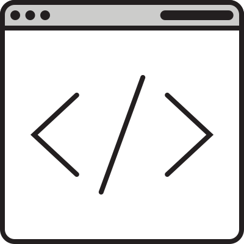

## Scope of Applicability {#applicability}

This methodology is designed to evaluate full, self-enclosed [digital products](#digital-product), such as websites. In [Step 1.a](#step1a), evaluators define what is in scope exactly. 

### Principle of Product Enclosure

Full product enclosure is essential, meaning that we define the scope to include all views, states and functionality of a digital product, without excluding specific parts. Excluding specific parts of a digital product from the scope would likely conflict with the WCAG 2.2 conformance requirements for [full pages](https://www.w3.org/TR/WCAG22/#cc2) and [complete processes](https://www.w3.org/TR/WCAG22/#cc3), or otherwise distort the evaluation results.

#### Example of Product Enclosure

An example of product enclosure could be the following banking website. It has distinct areas for personal banking, commercial banking, internet banking and service &amp; contact. It also has [common views](#common) that are linked from all pages, like their legal notice and sitemap:

When the target for evaluation is the whole banking website, then all of the depicted areas are within evaluation scope. This includes content such as application forms, authentication and internet banking. It would be irrelevant if some of the content is third-party content, as that would be included too. 

When the evaluation target is only a specific website area, like "Commercial Banking", then all the parts of this area are within the evaluation scope. In this example, that means the evaluation scope would include Payments, Mortgage, Loans and Savings, as well as the [common views](#common), the Legal Notice and Sitemap in this example.

### Considerations for Particular Types of Digital Products

This methodology is applicable to a broad variety of digital products. The following provides considerations for particular situations. 

<dl class="considerations-particular-products">
	

		<dt>Websites</dt>
		<dd>Websites exist in many sizes, anywhere from just the one page to collections of thousands or more. Websites with many pages can use the <a href="#step3">sampling procedure</a> to select a representative <a href="#sampleset">sample set</a>. On websites with a few pages, all pages can be evaluated and the <a href="#step3">sampling procedure</a> can be skipped. </dd>
	

	

		<dt>Web applications</dt>
		<dd>Web applications generally contain a lot of dynamically generated content and functionality. They tend to be more complex and interactive. Therefore, they typically require more time and effort to evaluate, and will typically need a larger <a href="#sampleset">sample set</a>. Some examples of web applications include web-based email clients, document editors, video sharing platforms, social media sites and booking platforms.
		</dd>
	

	

		<dt>Native, hybrid and cross-platform applications</dt>
		<dd>For native, hybrid and cross-platform applications, no list of URLs can be generated to base a representative <a href="#sampleset">sample set</a> on. Instead, samples can be identified with unique screenshots and/or descriptions of the path that lead to the specific <a href="#sample">sample</a>.</dd>
	

	

		<dt>Interfaces of kiosks, self-service terminals and set-top box interfaces</dt>
		<dd>When the interface can be tested in a browser, see the considerations for web applications.</dd>
		<dd>When the interface is evaluated while running on a hardware terminal, there is usually no way to generate a list of URLs. Samples can be identified with unique screenshots and/or descriptions of the path that lead to the specific <a href="#sample">sample</a>. When the kiosk interface can be tested in a browser, see the considerations for web applications.</dd>
	

	

		<dt>Documents</dt>
		<dd>When the evaluation target is a single document, the evaluation is usually scoped to the whole document or specific parts of it, depending on document complexity.</dd>
	

</dl>

This is not an exhaustive list.

### Particular Evaluation Contexts

This methodology can be applied in different situations and contexts. The following considerations apply to particular situations and contexts for an evaluation:

<dl>

<dt>Self-Assessment of Conformance</dt>
<dd>In-house evaluators and evaluators who are part of the development process often have easier access to the developers and maintainers of the digital product, the development and hosting environments, the authoring tools, and the materials used for development and maintenance. Particularly use cases, design analysis, technical specifications and documentation, and testing resources can make evaluation more effective and should be leveraged where possible.</dd>

<dt>Third-Party Assessment of Conformance</dt>
<dd>Independent external evaluators typically have less information about the digital product, internal software, areas, and functionality of a digital product as they have not been involved in its procurement and in how the digital product was designed and developed. Often evaluators in these situations need to contact the product's owner or developer to get necessary information that make the evaluation more effective.</dd>

<dt>Evaluating During Development</dt>
<dd>While this methodology has been primarily designed for reviewing digital products that are already developed, it is critical to evaluate accessibility throughout the design and implementation stages of a digital product to ensure its future conformance. The guidance provided in this methodology can be useful during these earlier stages of the design and development process, though some adaptation may be needed. However, it is important to be aware that evaluations carried out during these earlier stages can quickly become obsolete by implementing even minor changes. Consequently evaluations carried out during these stages should not be used for making statements nor conformance claims about the finalized digital product.</dd>

<dt>Evaluating Third-Party Content</dt>
<dd>Digital products do not control third-party content, like comments on a social media website or review aggregator. WCAG 2 provides specific considerations for the conformance of such type of content in the section <a href="https://www.w3.org/TR/WCAG22/#conformance-partial">Statement of Partial Conformance</a>. In such cases evaluators will need to determine whether such content is regularly monitored and repaired (within two business days), and whether non-conforming content is clearly identified as such in all the web pages in which it appears.</dd>

<dt>Re-Running Product Evaluation</dt>
<dd>Evaluation, according to this methodology, may be re-run after a short period; for example, when issues are identified and repaired by the product's owner or developer, or periodically to monitor progress. In such cases the evaluation can be carried out using a sample that includes:

* A sub-set of the <a href="#sample">samples</a> that were used in the preceding evaluation to facilitate comparability between the results;
* A replaced sub-set of <a href="#sample">samples</a> from those that were used in the preceding evaluation to improve view coverage;

Unless significant changes were made to the digital product, there is usually no need to change the size of the selected sample nor the approach used for sampling. The amount of replaced <a href="#sample">samples</a> in a fresh <a href="#sampleset">sample set</a> is typically about half of the initial <a href="#sampleset">sample set</a>, though this could be increased when views of a digital product mostly conform to WCAG 2.</dd>

<dt>Large-Scale Evaluation</dt>
<dd>Carrying out mass evaluation of many digital products, for example for national or international surveying, is typically carried out by primarily using automated evaluation tools. Relatively few views undergo full manual inspection. Such evaluations do not usually address the necessary qualitative depth of conformance review per product for which this methodology is designed.</dd>
</dl>